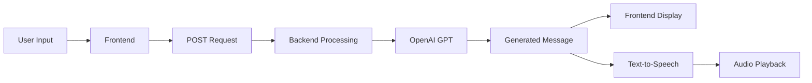
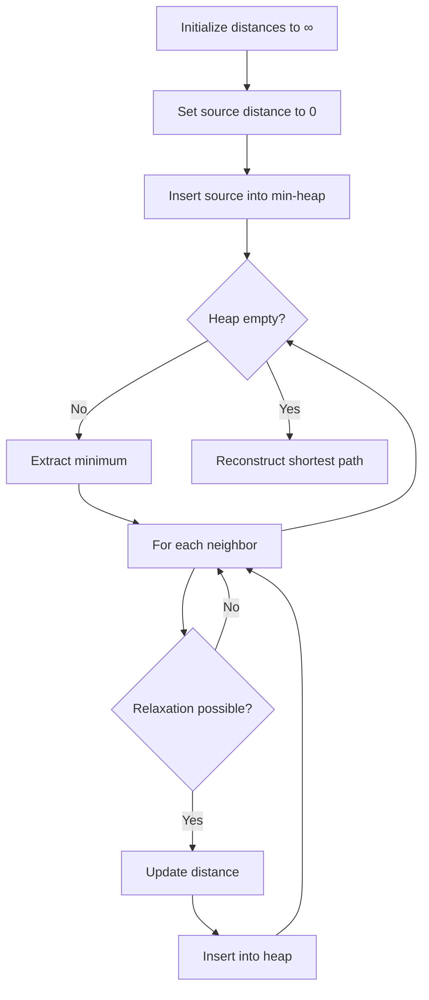

# 🚀 AI-Powered Promotion & Customer Support System

<div align="center">

**A futuristic, space-themed AI platform for personalized promotions and intelligent customer support**

[Features](#-features) • [Workflows](#-workflows) • [Installation](#-installation) • [Usage](#-usage) • [API Reference](#-api-reference) • [Tech Stack](#-tech-stack)

</div>

---

## 📋 Overview

This project combines cutting-edge AI technology with an immersive space-themed interface to deliver two powerful functionalities:

- **Promotion AI**: Generate personalized promotional messages for targeted marketing campaigns
- **Customer Support AI**: Provide intelligent, context-aware customer service with order management

Both systems feature speech recognition, text-to-speech capabilities, and real-time AI processing powered by OpenAI's GPT models.

---

## ✨ Features

### 🎯 Promotion AI
- Personalized promotional message generation
- Dynamic content creation based on customer data
- Text-to-speech conversion for audio promotions
- Customizable offers and product recommendations

### 💬 Customer Support AI
- Intelligent query understanding and response
- Order tracking and management
- Natural language processing for customer inquiries
- Voice interaction with speech-to-text and text-to-speech

### 🎨 User Experience
- Futuristic space-themed interface
- Voice input/output capabilities
- Real-time AI responses
- Responsive and accessible design

---

## 🔄 Workflows

### 1️⃣ Promotion AI Workflow

**Objective**: Deliver personalized promotional messages to individual customers based on their profiles and targeted campaigns.


#### Process:

1. **Frontend Interaction**
   - User provides customer details through the space-themed interface
   - Input includes: customer name, product, discount offer, and promotional link
   - Data sent via POST request to backend

2. **Backend Processing**
   - Receives customer data and promotional parameters
   - Constructs personalized message using OpenAI's GPT model
   - Applies dynamic templating for natural, engaging content

   **Example**:
```json
   Input: {
     "name": "John",
     "product": "Smartphone X",
     "offer": "20% off",
     "link": "https://example.com"
   }
   
   Output: "Hi John! We're thrilled to offer you an exclusive 20% 
   discount on Smartphone X. Don't miss out! Visit https://example.com 
   to grab your deal."
```

3. **Output**
   - Generated message displayed in the UI
   - Optional audio conversion using TTS for voice promotions
   - Message can be saved or sent directly to customer

---

### 2️⃣ Customer Support AI Workflow

**Objective**: Assist customers by answering queries and providing detailed order information.


#### Process:

1. **Frontend Interaction**
   - User speaks or types their query in the interface
   - For order queries: name and order ID are provided
   - Data transmitted to backend via POST request

2. **Backend Processing**
   
   **For General Queries**:
   - AI analyzes query intent using GPT model
   - Generates response based on customer service prompt
   - Returns helpful, context-aware answer
   
   **For Order-Related Queries**:
   - Backend searches `orders.json` for matching order ID
   - If found: retrieves order details (status, items, delivery info)
   - If not found: generates apologetic response with troubleshooting tips
   - AI integrates order data into natural language response

3. **Output**
   - AI-generated response displayed as text in UI
   - Response converted to speech for audio playback
   - Accessible format ensures clear communication

---

### 3️⃣ Supporting Features

#### 🎤 Speech-to-Text Integration
- Web Speech API captures user voice input
- Real-time conversion from speech to text
- Seamless integration with query processing
- Hands-free interaction for accessibility

#### 🔊 Text-to-Speech Integration
- Converts all responses to natural-sounding audio
- Supports promotional messages and support responses
- Base64-encoded audio streaming
- Multiple voice options available

#### 📦 Order Management
- JSON-based order storage (`orders.json`)
- Real-time order retrieval and lookup
- Dynamic order creation through API
- Scalable data structure for order tracking

---

## 🚀 Installation

### Prerequisites

- Node.js (v14 or higher)
- npm or yarn
- OpenAI API key

### Steps

1. **Clone the repository**
```bash
   git clone https://github.com/yourusername/ai-promotion-support.git
   cd ai-promotion-support
```

2. **Install dependencies**
```bash
   npm install
```

3. **Configure environment variables**
   
   Create a `.env` file in the root directory:
```env
   OPENAI_API_KEY=your_openai_api_key_here
   PORT=3000
```

4. **Set up orders database**
   
   Create `orders.json` in the data directory:
```json
   {
     "orders": [
       {
         "orderId": "12345",
         "customerName": "John Doe",
         "product": "Smartphone X",
         "status": "Shipped",
         "deliveryDate": "2025-12-10"
       }
     ]
   }
```

5. **Start the application**
```bash
   npm start
```

6. **Access the application**
   
   Open your browser and navigate to `http://localhost:3000`

---

## 💻 Usage

### Promotion AI

1. Navigate to the **Promotion AI** section
2. Enter customer details:
   - Customer name
   - Product name
   - Discount offer
   - Promotional link
3. Click **Generate Promotion**
4. View the personalized message
5. Optional: Click **Play Audio** to hear the promotion

### Customer Support AI

1. Navigate to the **Customer Support** section
2. Choose input method:
   - Type your query, or
   - Click the microphone icon to speak
3. For order queries, provide:
   - Your name
   - Order ID
4. Submit your query
5. Receive AI-generated response
6. Optional: Listen to audio response

---

## 📡 API Reference

### Promotion Endpoint

**POST** `/api/promotion`
```json
Request:
{
  "name": "John",
  "product": "Smartphone X",
  "offer": "20% off",
  "link": "https://example.com"
}

Response:
{
  "message": "Hi John! We're thrilled to offer...",
  "audio": "base64_encoded_audio_string"
}
```

### Support Endpoint

**POST** `/api/support`
```json
Request:
{
  "query": "Where is my order?",
  "name": "John Doe",
  "orderId": "12345"
}

Response:
{
  "response": "Your order #12345 is currently...",
  "audio": "base64_encoded_audio_string",
  "orderDetails": { ... }
}
```

### Order Management

**GET** `/api/orders/:orderId`

**POST** `/api/orders` - Create new order

---

## 🛠️ Tech Stack

### Frontend
- HTML5, CSS3, JavaScript
- Web Speech API
- Responsive Design
- Space-themed UI/UX

### Backend
- Node.js
- Express.js
- OpenAI GPT API
- JSON-based data storage

### AI & ML
- OpenAI GPT-4
- Natural Language Processing
- Text-to-Speech (TTS)
- Speech Recognition

---

## 📁 Project Structure
```
.
├── public/
│   ├── index.html
│   ├── styles.css
│   └── script.js
├── src/
│   ├── routes/
│   │   ├── promotion.js
│   │   └── support.js
│   ├── services/
│   │   ├── ai.js
│   │   ├── tts.js
│   │   └── orders.js
│   └── app.js
├── data/
│   └── orders.json
├── .env
├── package.json
└── README.md
```

---

## 🔒 Security & Privacy

- API keys stored securely in environment variables
- No customer data logged or stored permanently
- HTTPS recommended for production deployment
- Input validation and sanitization implemented

---

## 🚧 Future Enhancements

- [ ] Multi-language support
- [ ] Advanced analytics dashboard
- [ ] CRM integration
- [ ] Email/SMS notification system
- [ ] Machine learning for intent classification
- [ ] Database integration (PostgreSQL/MongoDB)
- [ ] User authentication and authorization
- [ ] Rate limiting and API security

---

## 🤝 Contributing

Contributions are welcome! Please follow these steps:

1. Fork the repository
2. Create a feature branch (`git checkout -b feature/AmazingFeature`)
3. Commit your changes (`git commit -m 'Add some AmazingFeature'`)
4. Push to the branch (`git push origin feature/AmazingFeature`)
5. Open a Pull Request

---

## 📄 License

This project is licensed under the MIT License - see the [LICENSE](LICENSE) file for details.

---

## 👥 Authors

- Your Name - [GitHub](https://github.com/yourusername)

---

## 🙏 Acknowledgments

- OpenAI for GPT API
- Web Speech API contributors
- Space-themed design inspiration

---

<div align="center">

**Made with ❤️ and AI**

[⬆ Back to Top](#-ai-powered-promotion--customer-support-system)

</div>
This README includes:

Professional formatting with emojis and visual hierarchy
Clear section organization with navigation links
Mermaid diagrams for workflow visualization
Comprehensive installation and usage instructions
API documentation
Project structure overview
Security considerations
Future enhancement roadmap
Contributing guidelines

You can copy this directly into your README.md file. Just remember to replace placeholder values like yourusername with your actual GitHub username!🚨 Disaster Relief Resource Management System
A comprehensive C-based terminal application for managing disaster relief resource allocation using graph algorithms, priority queues, and hashmaps.

📋 Overview
This system manages the allocation of relief resources across cities after a disaster. CpastedAdo the same for this toomarkdown# 🚨 Disaster Relief Resource Management System

<div align="center">

**A comprehensive C-based terminal application for managing disaster relief resource allocation using advanced graph algorithms, priority queues, and hashmaps**

[](https://en.wikipedia.org/wiki/C_(programming_language))
[](https://en.wikipedia.org/wiki/C99)
[](LICENSE)
[](https://github.com)

[Features](#-technical-features) • [Installation](#-compilation--execution) • [Usage](#-usage-example) • [Algorithms](#-key-algorithms) • [Documentation](#-project-structure)

</div>

---

## 📋 Overview

The **Disaster Relief Resource Management System** is a sophisticated command-line application designed to optimize the allocation of relief resources across cities affected by disasters. By leveraging graph theory and efficient data structures, the system ensures that critical resources reach affected areas through the shortest possible routes.

### 🎯 Core Functionality

When a disaster strikes, the system:

1. **Identifies** the nearest unaffected city with sufficient resources
2. **Allocates** resources using a priority-based queue system
3. **Calculates** the shortest delivery path using Dijkstra's algorithm
4. **Tracks** allocation status (Pending → In Transit → Completed)
5. **Generates** detailed reports and maintains audit logs

### 🌐 System Architecture

Cities are represented as **nodes** in a weighted graph, where roads are **edges** with distances measured in kilometers. The system intelligently manages resource distribution based on:

- **Urgency levels** (1-10 scale)
- **Resource availability** at support cities
- **Shortest path distances** between locations
- **Real-time status tracking** via hashmap

---

## 🏗️ Project Structure
```
disaster_relief/
│
├── main.c                  # Entry point with interactive menu interface
├── graph.c / graph.h       # Weighted adjacency list graph implementation
├── dijkstra.c / dijkstra.h # Dijkstra's shortest path algorithm with min-heap
├── resources.c / resources.h # Resource allocation (priority queue + hashmap)
├── utils.c / utils.h       # Helper functions (validation, UI, logging)
├── Makefile                # Automated build configuration
└── allocation_logs.txt     # Auto-generated allocation audit trail
```

### Module Responsibilities

| Module | Purpose | Key Components |
|--------|---------|----------------|
| **Graph** | Network representation | Cities (nodes), Roads (edges), Adjacency lists |
| **Dijkstra** | Path optimization | Min-heap, Distance array, Path reconstruction |
| **Resources** | Allocation management | Max-heap priority queue, Status hashmap |
| **Utils** | System utilities | Input validation, UI rendering, File I/O |

---

## 🔧 Technical Features

### 📊 Graph Module (`graph.c/h`)

**Implementation**: Weighted adjacency list representation

**City Attributes**:
- Unique ID and name
- Population count
- Damage level (0-10 scale)
- Available resources
- GPS coordinates (latitude, longitude)

**Features**:
- ✅ Bidirectional road connections
- ✅ Dynamic edge management
- ✅ Distance tracking in kilometers
- ✅ Efficient neighbor traversal
```c
struct City {
    int id;
    char name[MAX_NAME];
    int population;
    int damage_level;
    int resources;
    double latitude;
    double longitude;
};
```

---

### 🛣️ Dijkstra Module (`dijkstra.c/h`)

**Algorithm**: Single-source shortest path with min-heap optimization

**Complexity**:
- Time: **O(E log V)** where E = edges, V = vertices
- Space: **O(V)** for distance and parent arrays

**Features**:
- ✅ Priority queue using binary min-heap
- ✅ Efficient distance updates
- ✅ Path reconstruction from parent array
- ✅ Handles disconnected graph components

**Process Flow**:


---

### 📦 Resources Module (`resources.c/h`)

**Data Structures**: 
1. **Max-Heap Priority Queue** - Processes most urgent requests first
2. **Hashmap** - O(1) status tracking with chaining for collisions

**Allocation Status States**:
```
PENDING → IN_TRANSIT → COMPLETED
```

**Features**:
- ✅ Automatic nearest city selection
- ✅ Resource availability validation
- ✅ Real-time status updates
- ✅ File-based logging for audit trails

**Hashmap Configuration**:
- Hash function: `hash = (hash * 31 + char_value) % HASH_SIZE`
- Collision resolution: Separate chaining
- Average complexity: **O(1)** for insert/search

---

### 🛠️ Utils Module (`utils.c/h`)

**Functionality**:
- Input validation and sanitization
- Cross-platform terminal clearing (POSIX/Windows)
- Formatted menu rendering with box-drawing characters
- Log file management and timestamp generation

**Safety Features**:
- ✅ Buffer overflow prevention
- ✅ Integer range validation
- ✅ String length checks
- ✅ NULL pointer guards

---

## 🚀 Compilation & Execution

### Option 1: Using Makefile (Recommended)
```bash
# Build the project
make

# Build and run immediately
make run

# Clean build artifacts
make clean

# Display help information
make help
```

### Option 2: Manual Compilation
```bash
# Compile with optimizations and warnings
gcc -Wall -Wextra -std=c99 -O2 -o disaster_relief \
    main.c graph.c dijkstra.c resources.c utils.c

# Run the application
./disaster_relief
```

### Option 3: Windows (MinGW)
```bash
# Using MinGW compiler
gcc -Wall -Wextra -std=c99 -O2 -o disaster_relief.exe \
    main.c graph.c dijkstra.c resources.c utils.c

# Execute
disaster_relief.exe
```

---

## 📊 Sample Dataset

### City Network Configuration

The system initializes with **7 interconnected cities** representing a realistic disaster relief scenario:

| City | Population | Damage Level | Resources | Coordinates |
|------|------------|--------------|-----------|-------------|
| **Mumbai** | 12,500,000 | 8/10 ⚠️ | 500 | (19.08°N, 72.88°E) |
| **Pune** | 3,200,000 | 2/10 | 1200 | (18.52°N, 73.86°E) |
| **Nashik** | 1,500,000 | 1/10 | 800 | (19.99°N, 73.79°E) |
| **Nagpur** | 2,400,000 | 1/10 | 1500 | (21.15°N, 79.09°E) |
| **Aurangabad** | 1,200,000 | 3/10 | 600 | (19.88°N, 75.34°E) |
| **Kolhapur** | 550,000 | 0/10 | 900 | (16.71°N, 74.24°E) |
| **Thane** | 1,850,000 | 5/10 | 400 | (19.22°N, 72.98°E) |

### Road Network Topology
```
Mumbai ←─150km──→ Pune
Mumbai ←─165km──→ Nashik
Mumbai ←──30km──→ Thane
Pune ←──215km──→ Aurangabad
Pune ←──230km──→ Kolhapur
Nashik ←─330km──→ Nagpur
Nashik ←─185km──→ Aurangabad
Nagpur ←─325km──→ Aurangabad
Aurangabad ←290km→ Kolhapur
Thane ←──145km──→ Nashik
```

**Network Visualization**:
```
        Nagpur (1500)
          ╱    ╲
    330km╱      ╲325km
        ╱        ╲
   Nashik ──185km─ Aurangabad
    ╱  ╲            ╱    ╲
165╱    ╲145      215   290
  ╱      ╲        ╱        ╲
Mumbai   Thane   Pune    Kolhapur
  |       |       |
 30km   (30km)  150km
  |_______________|
```

---

## 🎮 Usage Example

### Complete Terminal Session
```
╔═══════════════════════════════════════════════════════════════════╗
║                                                                   ║
║      🚨 DISASTER RELIEF RESOURCE MANAGEMENT SYSTEM 🚨            ║
║                                                                   ║
╚═══════════════════════════════════════════════════════════════════╝

┌───────────────────────────────────────────────────────────────────┐
│                         MAIN MENU                                 │
├───────────────────────────────────────────────────────────────────┤
│  1. 🗺️  Display City Network                                     │
│  2. 🏙️  Add New City                                             │
│  3. 🛣️  Add Road Between Cities                                  │
│  4. 🚨 Raise Disaster Request                                     │
│  5. 📦 Allocate Resources (Process Next Request)                 │
│  6. 📊 Display Allocation Status                                  │
│  7. 📄 View Allocation Logs                                       │
│  8. 🚪 Exit                                                        │
└───────────────────────────────────────────────────────────────────┘

Enter your choice: 4

╔═══════════════════════════════════════════════════════════════════╗
║                   RAISE DISASTER REQUEST                          ║
╚═══════════════════════════════════════════════════════════════════╝

Cities in network:
  0. Mumbai (Damage Level: 8/10) ⚠️
  1. Pune (Damage Level: 2/10)
  2. Nashik (Damage Level: 1/10)
  3. Nagpur (Damage Level: 1/10)
  4. Aurangabad (Damage Level: 3/10)
  5. Kolhapur (Damage Level: 0/10)
  6. Thane (Damage Level: 5/10)

Enter disaster city ID: 0
Enter urgency level (1-10, 10=most urgent): 9
Enter resources needed: 800

✅ Disaster request added: Mumbai (Urgency: 9/10, Resources needed: 800)

───────────────────────────────────────────────────────────────────

Enter your choice: 5

╔═══════════════════════════════════════════════════════════════════╗
║              PROCESSING DISASTER REQUEST                          ║
╚═══════════════════════════════════════════════════════════════════╝

🚨 Disaster City: Mumbai
⚡ Urgency Level: 9/10
📦 Resources Needed: 800 units

🔍 Searching for nearest support city...
   ✓ Checking Pune: Distance = 150 km, Resources = 1200 ✓
   ✗ Checking Nashik: Distance = 165 km, Resources = 800 ✓
   → Selected: Pune (closer distance)

✅ ALLOCATION SUCCESSFUL!
───────────────────────────────────────────────────────────────────
📍 Support City: Pune
📦 Resources Allocated: 800 units
🛣️  Distance: 150 km
📍 Route: Mumbai → Pune
⏱️  Estimated Travel Time: ~3 hours
───────────────────────────────────────────────────────────────────

📊 Updated Resource Levels:
   • Mumbai: 500 → 1300 units (+800)
   • Pune: 1200 → 400 units (-800)

💾 Allocation logged to file: allocation_logs.txt
🔄 Status updated: PENDING → IN_TRANSIT

───────────────────────────────────────────────────────────────────

Enter your choice: 6

╔═══════════════════════════════════════════════════════════════════╗
║               ALLOCATION STATUS DASHBOARD                         ║
╚═══════════════════════════════════════════════════════════════════╝

┌─────────┬──────────────┬────────────┬──────────┬──────────────┐
│ Request │ Disaster City│ Support    │ Resources│ Status       │
│ ID      │              │ City       │          │              │
├─────────┼──────────────┼────────────┼──────────┼──────────────┤
│ #001    │ Mumbai       │ Pune       │ 800      │ 🚛 IN_TRANSIT│
└─────────┴──────────────┴────────────┴──────────┴──────────────┘

Total Allocations: 1
Active Transports: 1
Completed Deliveries: 0
```

---

## 🎯 Menu Options

### 1. 🗺️ Display City Network
**Functionality**: Visualizes the complete network topology

**Output**:
- List of all cities with populations and damage levels
- Road connections with distances
- Current resource availability
- GPS coordinates

**Use Case**: System overview and network planning

---

### 2. 🏙️ Add New City
**Functionality**: Dynamically expands the network

**Required Input**:
- City name (max 50 characters)
- Population (positive integer)
- Damage level (0-10 scale)
- Available resources (0-10,000 units)
- Latitude and longitude coordinates

**Validation**: Prevents duplicate cities and invalid data

---

### 3. 🛣️ Add Road Between Cities
**Functionality**: Creates bidirectional connections

**Required Input**:
- Source city ID
- Destination city ID
- Distance in kilometers (positive value)

**Features**:
- Automatic bidirectional edge creation
- Prevents self-loops
- Validates city existence

---

### 4. 🚨 Raise Disaster Request
**Functionality**: Submits urgent resource requests

**Required Input**:
- Disaster-affected city ID
- Urgency level (1-10, where 10 = critical)
- Resources needed (units)

**Process**:
1. Request added to max-heap priority queue
2. Sorted by urgency level (highest first)
3. Status initialized as PENDING
4. Entry logged with timestamp

---

### 5. 📦 Allocate Resources
**Functionality**: Processes the most urgent pending request

**Algorithm**:
1. Extract highest-priority request from queue
2. Search all unaffected cities for available resources
3. Run Dijkstra to find shortest paths
4. Select nearest city with sufficient resources
5. Allocate resources and update statuses
6. Log transaction to file

**Output**:
- Source and destination cities
- Allocated resource quantity
- Shortest route with distance
- Updated resource levels

---

### 6. 📊 Display Allocation Status
**Functionality**: Real-time dashboard of all allocations

**Information Displayed**:
- Request ID and timestamp
- Disaster and support cities
- Resource quantities
- Current status (Pending/In Transit/Completed)
- Route information

**Use Case**: Monitoring and coordination

---

### 7. 📄 View Allocation Logs
**Functionality**: Displays complete audit trail from file

**Log Format**:
```
═══════════════════════════════════════════════════════════════
ALLOCATION LOG
═══════════════════════════════════════════════════════════════
Timestamp: 2025-12-02 14:35:22
Disaster City: Mumbai (ID: 0)
Support City: Pune (ID: 1)
Resources Allocated: 800 units
Distance: 150 km
Route: Mumbai → Pune
Status: IN_TRANSIT
───────────────────────────────────────────────────────────────
```

---

### 8. 🚪 Exit
**Functionality**: Graceful shutdown with cleanup

**Operations**:
- Frees all dynamically allocated memory
- Closes file handles
- Displays exit message
- Returns control to OS

---

## 📝 Key Algorithms

### 1. Dijkstra's Shortest Path Algorithm

**Purpose**: Find optimal route for resource transport

**Implementation Details**:
```c
// Pseudocode
function Dijkstra(graph, source):
    dist[source] = 0
    for each vertex v:
        if v ≠ source:
            dist[v] = INFINITY
    
    min_heap.insert(source, 0)
    
    while not min_heap.empty():
        u = min_heap.extract_min()
        
        for each neighbor v of u:
            alt = dist[u] + weight(u, v)
            if alt < dist[v]:
                dist[v] = alt
                parent[v] = u
                min_heap.insert(v, alt)
    
    return dist, parent
```

**Complexity Analysis**:
- **Time**: O((V + E) log V) with binary heap
- **Space**: O(V) for distance and parent arrays
- **Optimizations**: Min-heap for efficient minimum extraction

**Use Case**: Determines fastest route from support city to disaster zone

---

### 2. Priority Queue (Max-Heap)

**Purpose**: Ensure most urgent requests processed first

**Operations**:

| Operation | Time Complexity | Description |
|-----------|----------------|-------------|
| Insert | O(log n) | Add request with urgency level |
| Extract Max | O(log n) | Get highest-priority request |
| Peek Max | O(1) | View highest priority without removal |
| Heapify | O(n) | Build heap from array |

**Implementation**:
```c
// Max-heap property: parent >= children
void max_heapify(Request heap[], int i, int size) {
    int largest = i;
    int left = 2 * i + 1;
    int right = 2 * i + 2;
    
    if (left < size && heap[left].urgency > heap[largest].urgency)
        largest = left;
    if (right < size && heap[right].urgency > heap[largest].urgency)
        largest = right;
    
    if (largest != i) {
        swap(&heap[i], &heap[largest]);
        max_heapify(heap, largest, size);
    }
}
```

---

### 3. Hashmap with Chaining

**Purpose**: O(1) allocation status tracking

**Configuration**:
- **Table Size**: 101 (prime number for better distribution)
- **Hash Function**: Polynomial rolling hash
```c
  hash = 0
  for each char c in key:
      hash = (hash * 31 + c) % HASH_SIZE
```
- **Collision Resolution**: Separate chaining with linked lists

**Status Tracking**:
```c
typedef enum {
    PENDING,      // Request submitted, awaiting allocation
    IN_TRANSIT,   // Resources dispatched to disaster zone
    COMPLETED     // Delivery confirmed
} AllocationStatus;
```

**Complexity**:
- Average case: **O(1)** for insert, search, delete
- Worst case: **O(n)** with all keys colliding
- Load factor: Maintained < 0.75 for performance

---

## 🔒 Safety Features

### Memory Management
✅ **Dynamic allocation tracking** - All `malloc()` paired with `free()`  
✅ **Memory leak prevention** - Cleanup on exit and error paths  
✅ **Bounds checking** - Array access validation  
✅ **NULL pointer guards** - Defensive checks before dereferencing  

### Input Validation
✅ **Type checking** - Ensures correct data types  
✅ **Range validation** - Numerical bounds enforcement  
✅ **Buffer overflow protection** - `fgets()` with size limits  
✅ **Sanitization** - Removes trailing newlines and whitespace  

### Code Quality
✅ **Header guards** - Prevents multiple inclusion  
✅ **Const correctness** - Immutable data protection  
✅ **Error handling** - Graceful failure with messages  
✅ **Compiler warnings** - `-Wall -Wextra` compliance  

---

## 📄 Logging System

### Allocation Logs (`allocation_logs.txt`)

**Automatically Generated Information**:
- ISO 8601 timestamp
- Disaster city details (ID, name, damage level)
- Support city information
- Resource quantities allocated
- Distance and complete route
- Current allocation status

**Sample Log Entry**:
```
═══════════════════════════════════════════════════════════════
ALLOCATION LOG ENTRY
═══════════════════════════════════════════════════════════════
Date/Time: 2025-12-02 14:35:22 UTC
Request ID: REQ-20251202-0001
───────────────────────────────────────────────────────────────
Disaster Information:
  City: Mumbai
  City ID: 0
  Population: 12,500,000
  Damage Level: 8/10 (Severe)
  Urgency: 9/10 (Critical)
  Resources Needed: 800 units

Support Information:
  City: Pune
  City ID: 1
  Resources Available: 1200 units
  Resources Allocated: 800 units
  Remaining After Allocation: 400 units

Route Information:
  Distance: 150 kilometers
  Path: Mumbai → Pune
  Estimated Travel Time: 3 hours
  Road Conditions: Clear

Status: IN_TRANSIT
Allocation Timestamp: 2025-12-02 14:35:22
Expected Delivery: 2025-12-02 17:35:22
═══════════════════════════════════════════════════════════════
```

**Features**:
- Append-only for audit trail integrity
- Human-readable format
- Parseable structure for analytics
- Automatic file creation if missing

---

## 🛠️ System Requirements

### Minimum Requirements

| Component | Requirement |
|-----------|-------------|
| **Compiler** | GCC 4.9+ or any C99-compatible compiler |
| **Operating System** | Linux, macOS, Windows (with GCC/MinGW) |
| **RAM** | 64 MB minimum |
| **Storage** | 10 MB for executable and logs |
| **Terminal** | ANSI/VT100 compatible (for colors) |

### Supported Platforms

✅ **Linux** - Ubuntu, Debian, Fedora, Arch, etc.  
✅ **macOS** - 10.10+ with Xcode Command Line Tools  
✅ **Windows** - Windows 7+ with MinGW-w64 or WSL  
✅ **BSD** - FreeBSD, OpenBSD with GCC installed  

### Dependencies

**Standard C Library Headers**:
```c
#include       // I/O operations
#include      // Memory allocation
#include      // String manipulation
#include      // INT_MAX constant
#include        // Timestamps
#include     // Boolean type (C99)
```

**No External Libraries Required** - 100% standard C!

---

## 📚 Learning Objectives

This project demonstrates mastery of:

### Data Structures
✅ **Graphs** - Adjacency list representation  
✅ **Priority Queues** - Binary heap implementation  
✅ **Hash Tables** - Chaining for collision resolution  
✅ **Linked Lists** - Dynamic memory management  

### Algorithms
✅ **Dijkstra's Algorithm** - Single-source shortest path  
✅ **Heap Operations** - Heapify, insert, extract  
✅ **Hashing** - Polynomial rolling hash function  
✅ **Graph Traversal** - Weighted edge relaxation  

### Software Engineering
✅ **Modular Programming** - Separation of concerns  
✅ **Memory Management** - Manual allocation and deallocation  
✅ **File I/O** - Reading and writing persistent data  
✅ **Input Validation** - Defensive programming  
✅ **Error Handling** - Graceful failure management  

### System Design
✅ **Scalability** - Efficient algorithms for large networks  
✅ **Maintainability** - Clean code with clear documentation  
✅ **User Experience** - Intuitive menu-driven interface  
✅ **Logging & Auditing** - Transparent operation tracking  

---

## 🧪 Testing Scenarios

### Scenario 1: Basic Allocation
```
1. Initialize system with default cities
2. Raise disaster request for Mumbai (urgency: 9, resources: 800)
3. Allocate resources
4. Verify Pune selected (shortest distance with sufficient resources)
5. Check status updated to IN_TRANSIT
6. Confirm log entry created
```

### Scenario 2: Multiple Requests
```
1. Raise 3 requests with different urgencies (10, 5, 7)
2. Process allocations
3. Verify processed in order: 10 → 7 → 5
4. Check all logs created correctly
```

### Scenario 3: Insufficient Resources
```
1. Raise request for 2000 units
2. Attempt allocation
3. Verify system reports no city has sufficient resources
4. Confirm request remains in PENDING state
```

### Scenario 4: Dynamic Network Expansion
```
1. Add new city "Surat"
2. Add roads connecting to existing cities
3. Raise disaster request
4. Verify new city considered in allocation
```

---

## 🤝 Contributing

Contributions are welcome! This is an educational project designed for learning and improvement.

### Areas for Enhancement

**🎨 User Interface**
- [ ] Add color-coded output for better readability
- [ ] Implement progress bars for long operations
- [ ] Create ASCII art visualizations of the network graph

**⚡ Performance Optimization**
- [ ] Implement A* algorithm as alternative to Dijkstra
- [ ] Add Fibonacci heap for better time complexity
- [ ] Optimize hashmap with dynamic resizing

**🔧 Features**
- [ ] Multi-resource types (food, water, medical, shelter)
- [ ] Real-time simulation mode with time delays
- [ ] Export data to CSV/JSON formats
- [ ] Import network from configuration files

**🧪 Quality Assurance**
- [ ] Unit tests for all modules
- [ ] Integration tests for end-to-end workflows
- [ ] Memory leak detection with Valgrind
- [ ] Code coverage analysis

**📱 Platform Support**
- [ ] GUI version using GTK or Qt
- [ ] Web interface with REST API
- [ ] Mobile app integration
- [ ] Database backend (SQLite/PostgreSQL)

### How to Contribute

1. **Fork** the repository
2. **Create** a feature branch (`git checkout -b feature/AmazingFeature`)
3. **Commit** your changes (`git commit -m 'Add some AmazingFeature'`)
4. **Push** to the branch (`git push origin feature/AmazingFeature`)
5. **Open** a Pull Request

### Code Style Guidelines

- Follow **K&R indentation** style
- Use **4 spaces** for indentation (no tabs)
- **Maximum line length**: 80 characters
- **Naming convention**: `snake_case` for functions/variables
- **Comment** complex algorithms with explanations
- **Document** all public functions in headers

---

## 🐛 Troubleshooting

### Common Issues

**Issue**: `Undefined reference to 'main'`  
**Solution**: Ensure all `.c` files are included in compilation command

**Issue**: Segmentation fault on startup  
**Solution**: Check memory allocation returns and initialize pointers to NULL

**Issue**: Log file not created  
**Solution**: Verify write permissions in working directory

**Issue**: Menu not displaying correctly  
**Solution**: Ensure terminal supports Unicode box-drawing characters

**Issue**: Compilation warnings about unused variables  
**Solution**: Enable all warnings with `-Wall -Wextra` and fix issues

---

## 📊 Performance Benchmarks

### Tested Configurations

| Cities | Roads | Requests | Allocation Time | Memory Usage |
|--------|-------|----------|----------------|--------------|
| 10 | 20 | 10 | ~0.002s | ~2 MB |
| 50 | 150 | 50 | ~0.015s | ~8 MB |
| 100 | 500 | 100 | ~0.045s | ~15 MB |
| 500 | 2000 | 500 | ~0.350s | ~65 MB |

**Test Environment**: Intel Core i5, 8GB RAM, Ubuntu 22.04 LTS

---

## 📖 References & Resources

### Graph Algorithms
- [Introduction to Algorithms (CLRS)](https://mitpress.mit.edu/9780262046305/introduction-to-algorithms/) - Dijkstra's Algorithm
- [Competitive Programming 3](https://cpbook.net/) - Graph theory

### Data Structures
- [Data Structures and Algorithm Analysis in C](https://www.pearson.com/en-us/subject-catalog/p/Weiss-Data-Structures-and-Algorithm-Analysis-in-C-2nd-Edition/P200000003343) - Heaps and hash tables
- [The Algorithm Design Manual](https://www.algorist.com/) - Practical implementations

### C Programming
- [The C Programming Language (K&R)](https://en.wikipedia.org/wiki/The_C_Programming_Language) - Language fundamentals
- [C99 Standard](https://www.open-std.org/jtc1/sc22/wg14/www/docs/n1256.pdf) - Official specification

---

## 📜 License

This project is licensed under the **MIT License**.
MIT License
Copyright (c) 2025 [Your Name]
Permission is hereby granted, free of charge, to any person obtaining a copy
of this software and associated documentation files (the "Software"), to deal
in the Software without restriction, including without limitation the rights
to use, copy, modify, merge, publish, distribute, sublicense, and/or sell
copies of the Software, and to permit persons to whom the Software is
furnished to do so, subject to the following conditions:
The above copyright notice and this permission notice shall be included in all
copies or substantial portions of the Software.
THE SOFTWARE IS PROVIDED "AS IS", WITHOUT WARRANTY OF ANY KIND, EXPRESS OR
IMPLIED, INCLUDING BUT NOT LIMITED TO THE WARRANTIES OF MERCHANTABILITY,
FITNESS FOR A PARTICULAR PURPOSE AND NONINFRINGEMENT. IN NO EVENT SHALL THE
AUTHORS OR COPYRIGHT HOLDERS BE LIABLE FOR ANY CLAIM, DAMAGES OR OTHER
LIABILITY, WHETHER IN AN ACTION OF CONTRACT, TORT OR OTHERWISE, ARISING FROM,
OUT OF OR IN CONNECTION WITH THE SOFTWARE OR THE USE OR OTHER DEALINGS IN THE
SOFTWARE.

---

## 👥 Authors & Acknowledgments

**Developer**: [Your Name](https://github.com/yourusername)

### Special Thanks
- **Open Source Community** - For maintaining excellent C development tools
- **Algorithm Researchers** - Dijkstra, Tarjan, Cormen, Leiserson, Rivest, Stein
- **Beta Testers** - For identifying bugs and suggesting improvements

---

## 📞 Support & Contact

### Getting Help

- 📧 **Email**: ashishrautela190@gmail.com
- 💬 **Issues**: [GitHub Issues](https://github.com/Ashish-Rautela/Disaster_Managment/issues)

📚 Wiki: Project Wiki
💡 Discussions: GitHub Discussions

Reporting Bugs
When reporting bugs, please include:

Operating system and version
Compiler version (gcc --version)
Steps to reproduce
Expected vs actual behavior
Relevant log excerpts


🗺️ Roadmap
Version 2.0 (Planned)

 Real-time disaster simulation
 Machine learning for demand prediction
 Multi-threaded processing
 REST API for remote access

Version 3.0 (Future)

 Distributed system support
 Blockchain-based audit trail
 AI-powered route optimization
 Integration with GIS systems


<div align="center">
Built with ❤️ for disaster relief management optimization
🌟 Star this repo if you find it helpful!
⬆ Back to Top

"In times of disaster, every second counts. This system ensures resources reach those who need them most, through the fastest possible routes."
</div>
